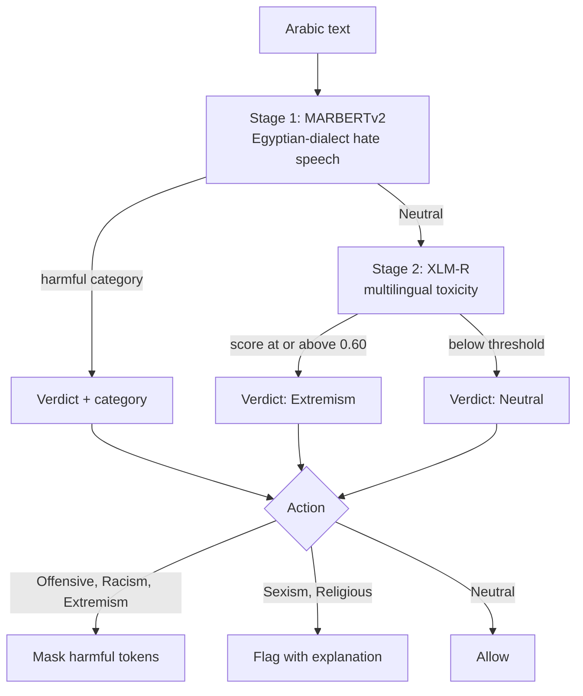

# Arabic Content Moderation

A two-stage classifier cascade for **Egyptian-dialect Arabic**. The first stage gives
dialect-specific categories, the second catches the implicit hostility the first misses.
Returns a category, a recommended action, an Arabic explanation, and optional word-level
redaction, over a FastAPI service.

<p align="left">
  
  
  
  
</p>

---

## What we tried

Four architectures were built and compared before settling on the two-stage cascade. All
of them are preserved in [`notebooks/`](notebooks/) so the reasoning is auditable.

| # | Architecture | Outcome | Why it was rejected or kept |
|---|---|---|---|
| 1 | MARBERTv2 alone | Precision 0.947, recall 0.720 | Precise categories, but misses hostility that carries no hate *word* |
| 2 | Parallel ensemble: hate + toxicity + CAMeLBERT, combined | No gain | Averaging dilutes stage 1's category labels, which are the actionable output |
| 3 | Three-stage: hate, then toxicity, then CAMeLBERT | No measurable lift over two-stage | CAMeLBERT is a base encoder, not a classifier, so it added cost without a decision |
| 4 | **Two-stage: hate, then toxicity on Neutral only** | **F1 0.818 to 0.863** | **Kept.** Targets the recall gap without touching the precise categories |

The notebook's own working note captured the problem that drove this: the dialect model
*"detects hate/offensive speech well, but if the sentence does not contain a hate **word**,
it's not detected."* That is a recall gap on implicit hostility, not a precision problem,
which is what makes a cascade the right shape rather than an ensemble.



## Results

36 hand-labelled Egyptian-dialect examples. The **stage-1-only ablation** is the number
that matters, because without it the cascade's score means nothing.

### Binary: harmful vs neutral

| Configuration | Accuracy | Precision | Recall | F1 |
|---|---:|---:|---:|---:|
| Stage 1 only (MARBERTv2) | 0.778 | **0.947** | 0.720 | 0.818 |
| **Full cascade** | **0.806** | 0.846 | **0.880** | **0.863** |

**The second stage does exactly what it was added to do.** Recall climbs from 0.720 to
0.880, catching 4 harmful messages the dialect model let through. The cost is precision,
down from 0.947 to 0.846. Net F1 improves from 0.818 to 0.863.

Whether that trade is correct **depends on the platform**, and it is a policy decision
rather than a modelling one. A platform where missed abuse is the greater harm should take
the cascade. One where over-blocking drives users away should keep stage 1 alone, or raise
`TOXICITY_THRESHOLD` above its 0.60 default to buy back precision.

### Multi-class: 6 categories

| Configuration | Accuracy | Macro F1 |
|---|---:|---:|
| Stage 1 only | 0.722 | n/a |
| Full cascade | 0.722 | 0.783 |

**Identical**, and that is expected: stage 2 can only ever emit `Extremism`, so it adds
recall on the binary question without adding category granularity.

| Category | Precision | Recall | F1 | Support |
|---|---:|---:|---:|---:|
| Sexism | 1.00 | 1.00 | 1.00 | 3 |
| Religious Discrimination | 1.00 | 1.00 | 1.00 | 2 |
| Offensive | 0.88 | 0.88 | 0.88 | 8 |
| Racism | 0.67 | 0.80 | 0.73 | 5 |
| Neutral | 0.70 | 0.64 | 0.67 | 11 |
| **Extremism** | **0.43** | **0.43** | **0.43** | 7 |

Perfect scores on Sexism and Religious Discrimination rest on 3 and 2 examples. They are
not evidence of anything, they are what a tiny support column looks like.

### Where it fails

All 10 errors, because the pattern in them is more informative than the aggregate:

| Expected | Predicted | Text | What went wrong |
|---|---|---|---|
| Extremism | Neutral | اللي مش معانا يبقى عدو ولازم يتصفّى | "whoever is not with us is an enemy and must be liquidated", **missed entirely** |
| Extremism | Neutral | ياريت الناس دي كلها تختفي من الدنيا | Eliminationist wish, phrased without a slur |
| Extremism | Neutral | اللي رأيه غير رأيي يبقى عدوى | Dehumanising framing, no explicit threat |
| Extremism | Offensive | لازم نكسر ونولّع فيهم | Incitement downgraded to insult |
| Neutral | Extremism | يجب قتل الحشرات الضارة | "pests must be killed", meaning **pest control** |
| Neutral | Extremism | عايزة أقتل الحشرات الضارة | Same trap, first person |
| Neutral | Extremism | المباراة كانت وحشة والفريق لعب سيء | Criticising a football match |
| Neutral | Racism | الراجل الاسود طبيب | "the black man is a doctor", a **neutral statement mentioning race** |
| Offensive | Racism | انت عبد وملكش قيمة | Category confusion, correctly caught as harmful |
| Racism | Extremism | الناس من البلد دي كلهم كذابين | Category confusion, correctly caught as harmful |

Three distinct failure modes:

1. **Implicit extremism is the real weakness** (recall 0.43). Every miss is a threat carried
   by *structure*, phrases like "must be eliminated" or "should disappear", rather than by a
   flaggable word. This is precisely the gap the cascade was meant to close, and it only
   partly does.
2. **Both models are keyword-triggered, not semantic.** قتل ("kill") fires on pest control,
   and اسود ("black") fires on a sentence stating that someone is a doctor. **The race false
   positive is the most serious error here**, because a moderation system that flags neutral
   mentions of race will disproportionately silence the people it exists to protect.
3. **Category confusion is benign.** The last two rows are "wrong" but both were correctly
   identified as harmful and would be actioned, so multi-class accuracy understates
   deployment usefulness.

> **Note on reproducibility:** these are the models' genuine outputs, not an artefact of
> the refactor. Running the notebook's exact routing logic on the same 36 examples produces
> **byte-identical predictions**, and the notebook's own saved outputs show the same
> failures, including `اللي مش معانا يبقى عدو ولازم يتصفّى` returning `LABEL_0` at 0.585 and
> passing as clean. What changed is measurement, not behaviour: the notebook printed
> results without scoring them.

### Throughput

**0.39 seconds per example** end to end on CPU, 36 examples in 14.2 seconds, including
word-level masking. 17 of 36 inputs escalated to stage 2. Actions taken: 10 allow, 5 flag,
21 mask.

## What changed from the research notebook

**Low-confidence neutrals are handled.** The notebook branched on a bare
`label == "neutral"` string check, so a 0.34-confidence neutral was treated as settled.
Confidence now participates in routing.

**Stage 2 must clear a threshold to overturn stage 1.** The notebook accepted any
`LABEL_1`, including a 0.51 coin flip. A broad multilingual model misreads dialect, so
making it earn the overturn is what keeps that from becoming a false positive.

**Label normalisation is centralised.** The two models emit incompatible vocabularies,
readable category names with inconsistent casing versus `LABEL_0` and `LABEL_1`. That
mapping now lives in [`labels.py`](src/moderation/labels.py) with tests, instead of being
string-matched at each call site. Unknown labels **fail closed to `Offensive`**, never to
`Neutral`: if a model flagged something under a name we do not recognise, treating it as
clean is the more dangerous error.

**Masking has its own, higher threshold**, 0.80 against 0.60 to flag. Over-redacting a
clean word is visible and irritating, and the sentence is already flagged, so the bar to
redact should exceed the bar to act.

**Sexism and religious discrimination are flagged, not masked.** Both are usually carried
by sentence structure rather than a removable word, so masking produces a mutilated
sentence that still says the same thing.

## Quickstart

```bash
git clone https://github.com/yasmine-ali101/ai-content-moderation.git
cd ai-content-moderation

python -m venv .venv && source .venv/bin/activate   # Windows: .venv\Scripts\activate
pip install -r requirements.txt

python scripts/evaluate.py    # reproduces every number above
pytest                        # 36 tests, no model download needed
```

> First run downloads roughly 3 GB of weights. `sentencepiece` and `tiktoken` are required,
> since XLM-R's tokenizer fails to load without them and the error it raises is opaque.

### As a library

```python
from moderation import ModerationPipeline

verdict = ModerationPipeline().moderate("انتي غبية")

verdict.category      # 'Offensive'
verdict.action        # 'mask'
verdict.masked_text   # 'انتي ****'
verdict.explanation   # Arabic rationale shown to the user
verdict.escalated     # False, stage 1 was confident
```

### As a service

```bash
uvicorn moderation.api:app --reload
```

```bash
curl -X POST localhost:8000/moderate \
     -H 'Content-Type: application/json' \
     -d '{"text": "انت غبي"}'
```

| Endpoint | Purpose |
|---|---|
| `POST /moderate` | Single text |
| `POST /moderate/batch` | Up to 64 texts |
| `GET /health` | Readiness and active model names |

Models load once at startup rather than per request, because a cold `from_pretrained` costs
tens of seconds and would otherwise dominate every response.

## Configuration

| Variable | Default | Effect |
|---|---|---|
| `TOXICITY_THRESHOLD` | `0.60` | Raise to buy precision back from the cascade |
| `NEUTRAL_CONFIDENCE_FLOOR` | `0.85` | Below this, stage 1's neutral is treated as shaky |
| `MASK_THRESHOLD` | `0.80` | Word-level redaction confidence |
| `MODERATION_DEVICE` | `-1` | `-1` for CPU, `0` for the first GPU |
| `HATE_MODEL`, `TOXICITY_MODEL` | see [`config.py`](src/moderation/config.py) | Swap either stage |

## Project structure

```
src/moderation/
├── config.py       # thresholds and model selection, env-driven
├── labels.py       # canonical vocabulary and fail-closed normalisation
├── pipeline.py     # the cascade, masking, and action policy
├── evaluation.py   # binary and multi-class scoring
└── api.py          # FastAPI service
scripts/evaluate.py # reproduces the results above
data/eval_set.json  # 36 hand-labelled examples
results/            # metrics.json, metrics.md (regenerated)
tests/              # 36 tests, all stubbed, no model download
```

## Limitations

These bound what the numbers above are worth:

- **The evaluation set has 36 examples and was annotated by the project authors.** There is
  no inter-annotator agreement and no held-out split. Per-category figures resting on 2 or 3
  examples are illustrative, not measurements. Treat every number here as a smoke test
  rather than a benchmark, since a real deployment needs a few thousand examples labelled by
  multiple annotators.
- **The notebook itself labelled one sentence inconsistently.** `الراجل الاسود طبيب` is
  marked Neutral in one cell and Racism in another, and one of the 10 errors above is a
  disagreement with that choice.
- **Several examples are genuinely multi-label.** `انت كلب ومتخلف الستات مكانهم المطبخ` is
  both Offensive and Sexism but is annotated with a single most-severe category, so the
  multi-class score penalises the model for picking the other valid label.
- **Extremism recall is 0.43**, so the system should not be relied on for threat detection.
- **Neutral precision is 0.70**, meaning roughly a third of clean messages get flagged. That
  is a poor user experience and the first thing to fix.
- **No Modern Standard Arabic evaluation.** Both the eval set and stage 1 are
  Egyptian-dialect, so behaviour on MSA or Gulf and Levantine dialects is untested.
- **Word-level masking is a blunt instrument.** These models were trained on sentences, and
  a single word out of context is a distribution they never saw.
- **No adversarial testing.** Character substitution, elongation (كككلب), or Arabizi
  transliteration would likely defeat it.

## Attribution

Built as a group project for the **BARQ** AI program by **Habiba, Yasmine Ali, and Aliaa**.
This repository is the productionised refactor, covering routing logic, thresholds, label
normalisation, the evaluation harness, the API, and tests, of our shared research notebook,
which is preserved in [`notebooks/`](notebooks/).

Models are third-party:
[MARBERTv2 fine-tune](https://huggingface.co/IbrahimAmin/marbertv2-finetuned-egyptian-hate-speech-classification)
by Ibrahim Amin, and
[xlm-r-large-arabic-toxic](https://huggingface.co/akhooli/xlm-r-large-arabic-toxic)
by Abed Khooli.

## License

[MIT](LICENSE)
